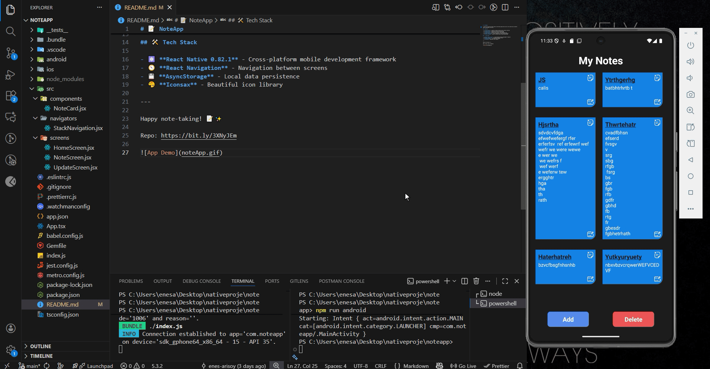

# 📝 NoteApp

A simple and intuitive React Native note-taking application built with TypeScript and modern mobile development practices.

## ✨ Features

- 📌 **Create Notes** - Quickly create new notes with a simple interface
- ✏️ **Edit Notes** - Modify your existing notes anytime
- 🗑️ **Delete Notes** - Remove notes you no longer need
- 🔍 **View Notes** - Browse all your notes in an organized list
- 📱 **Mobile Optimized** - Works seamlessly on both iOS and Android
- 💾 **Local Storage** - Notes are saved locally using AsyncStorage

## 🛠️ Tech Stack

- ⚛️ **React Native 0.82.1** - Cross-platform mobile development framework
- 🧭 **React Navigation** - Navigation between screens
- 💾 **AsyncStorage** - Local data persistence
- 🎨 **Iconsax** - Beautiful icon library

---

Happy note-taking! 📝✨

Repo: 

